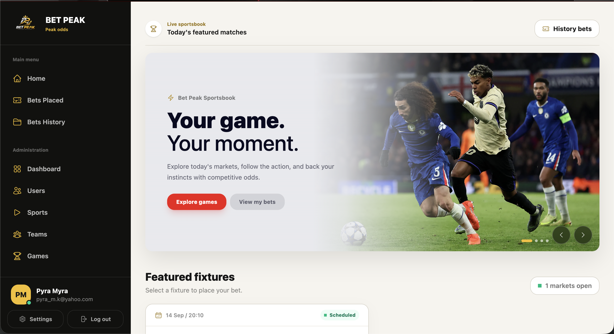

# BetPeak

BetPeak is a sports betting web application built with Phoenix LiveView. Users can browse
fixtures, place and manage bets, review settled results, and receive account and bet-result
emails. Administrators can manage users, sports, teams, games, and betting outcomes.



## Features

- User registration, login, email confirmation, and account settings
- Upcoming fixtures with home, draw, and away odds
- Bet placement, active bets, and betting history
- Automatic win/loss settlement when a game finishes
- Stake-based settlement priority using Oban queues
- Background email delivery with retry support
- Soft deletion for users, games, teams, sports, and bets
- Role-protected administration for users and sports data
- Responsive Phoenix LiveView interface

## Technology

- Elixir and Phoenix 1.8
- Phoenix LiveView and HEEx
- PostgreSQL with Ecto
- Oban background jobs
- Swoosh with Gmail SMTP
- Tailwind CSS 4 and DaisyUI
- Bandit web server

## Requirements

- Elixir 1.17 or later
- A compatible Erlang/OTP installation
- PostgreSQL
- A Gmail app password if email delivery is required locally

The default development database configuration expects PostgreSQL at `localhost` with the
username and password `postgres`. Update `config/dev.exs` if your local setup differs.

## Setup

1. Configure Gmail SMTP credentials when testing email delivery:

	```bash
	export GMAIL_USER="your-address@gmail.com"
	export GMAIL_APP_PASSWORD="your-gmail-app-password"
	```

	Use a Gmail app password rather than your normal account password. Do not commit these
	values to the repository.

2. Install dependencies, create the database, run migrations, seed data, and build assets:

	```bash
	mix setup
	```

3. Start Phoenix:

	```bash
	mix phx.server
	```

	To run Phoenix inside an interactive Elixir shell instead:

	```bash
	iex -S mix phx.server
	```

4. Open [http://localhost:4000](http://localhost:4000).

## Application Areas

| Area | Purpose |
| --- | --- |
| Home | Browse featured fixtures and available betting markets |
| Bets Placed | Review pending bets |
| Bets History | Review won, lost, and cancelled bets |
| Admin Dashboard | View administration activity |
| Users | Review accounts, access levels, and user bet statistics |
| Sports and Teams | Maintain the sports catalogue and participating teams |
| Games | Configure fixtures, odds, status, and final results |

User betting routes require authentication and a confirmed account. Administration routes
also require an administrator account.

## Background Jobs

BetPeak uses Oban for work that should not block a LiveView request:

- `settle_bet` settles pending bets after a game is marked as finished. Larger stakes receive
  higher queue priority.
- `send_mail` delivers notification emails and retries failed deliveries.
- `soft_delete` processes deferred soft-deletion work.

Oban jobs are stored in PostgreSQL, so queued work survives application restarts.

## Development Commands

```bash
mix test          # Run the test suite
mix ecto.reset    # Recreate and seed the development database
mix precommit     # Compile strictly, format, and run tests
```

Development-only tools are available at:

- [LiveDashboard](http://localhost:4000/dev/dashboard)
- [Swoosh mailbox preview](http://localhost:4000/dev/mailbox)

## Production Environment

Production expects the standard Phoenix environment variables:

- `DATABASE_URL`
- `SECRET_KEY_BASE`
- `PHX_HOST`
- `PORT` (optional; defaults to `4000`)
- `POOL_SIZE` (optional; defaults to `10`)
- `PHX_SERVER=true` when starting a release directly

Production mail delivery must also be configured for the chosen Swoosh adapter.
